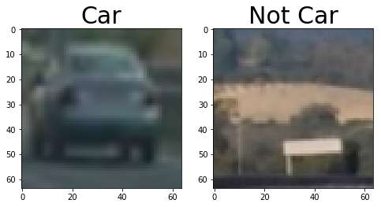
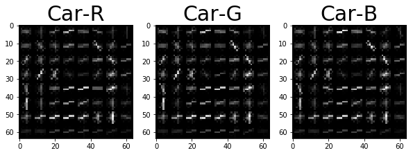
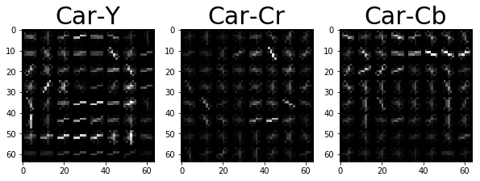
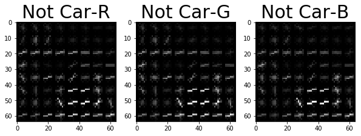
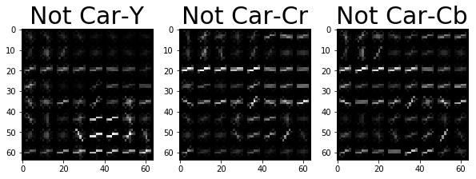
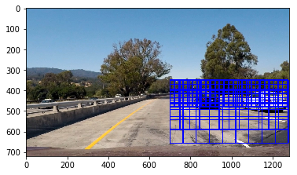
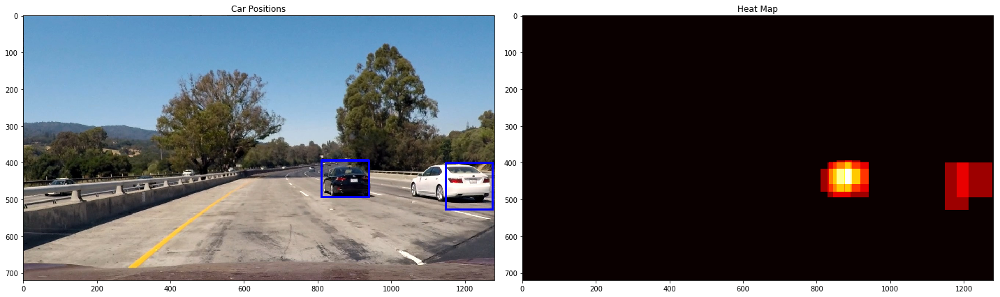
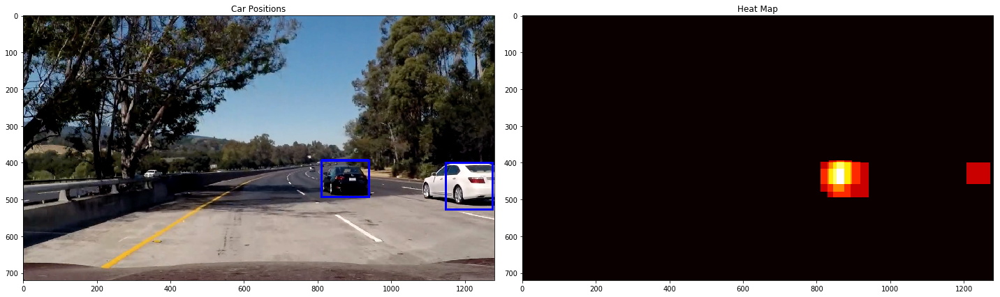

# Vehicle Detection Project

The goals / steps of this project are the following:

* Perform a Histogram of Oriented Gradients (HOG) feature extraction on a labeled training set of images and train a classifier Linear SVM classifier
* Apply a color transform and append binned color features, as well as histograms of color, to HOG feature vector.
* Normalize features and randomize a selection for training and testing.
* Implement a sliding-window technique and use the trained classifier to search for vehicles in images.
* Run your pipeline on a video stream (full project_video.mp4) and create a heat map of recurring detections frame by frame to reject outliers and follow detected vehicles.
* Estimate a bounding box for vehicles detected.

### Histogram of Oriented Gradients (HOG)
In this project i have used HOG features and color features to train the model.
Let's see the visualization of HOG features in different color channels.

HOG features for RGB and YCrCb channel looks good.After experimentation on training the model and checking accuracy(in the upcoming steps) i **decided to go with YCrCb channel** for extracting HOG features.
For the parameters: First i used the parameters in the code from the classroom, i played with them a bit,time taken using larger pix_per_cell(16) and cell_per_block(4) was much less as compared to the default values (8,2) given in the classroom. But after running the pipeline on video steam. The results with the default values were much better.

I used the `spatial_size` as 16,16. This reduced the length of feature vector but satisfactory results were obtained with this,same is the case with `hist_bins`

### Training the classifier

I used `SVC with rbf kernel and C parameter as 10` because a higher value of C because a high C aims at classifying all training examples correctly [Source](http://scikit-learn.org/stable/auto_examples/svm/plot_rbf_parameters.html). False positives were much less detected with rbf kernel of SVC instead of Linear SVC.
I have used the StandardScaler(line 13 of below cell) from sklearn to normalize features by removing the mean and scaling it to unit variance.
The total data was split into 80% training data and 20% test data using train_test_split from sklearn and fed it a random number between 0 and 100(lines 8 - 10 of below cell).
I am getting `test accuracy between 98.8 and 99.3%`. It varies slightly everytime i run it. 
    

## Sliding Window Search

I found choosing the right number and size of sliding windows really important for this project.But more the number of windows more time it takes to generate the output and the machines provided to us were not high end, so i limited the region of interest. I started **sliding windows from 700 px in X direction to the end and 350px in Y direction to 656 px**.

I choose window of size `64x64 with an overlap of 65% within the interest range of 350px to 500px(Y-dir)` because the cars which are from away from our car will appear smaller in the image and will be on the upper region of the image.Going with this approach i choose `another window with size 96x96 to slide over the region 350px to 600px(Y-dir) with an overlap of 50%` and the `last window with size 128x128 to slide over the region 400px to 656px(Y-dir) with an overlap of 50%`.

The output of the sliding windows and the car detection after searching through the windows is shown below.

## Combining overlapping bounding boxes and removing false positives

I recorded the positions of positive detections in each frame of the video for 10 consecutive frames.So for each new frame I am using the positive detections of that frame along with the previous 9 frames and I created a heatmap and then thresholded that map to identify vehicle positions. I then used scipy.ndimage.measurements.label() to identify individual blobs in the heatmap. I then assumed each blob corresponded to a vehicle. I constructed bounding boxes to cover the area of each blob detected.

For the purpose of displaying heatmap for a single image I am not considering the past 9 frames, that will be done on the video pipeline.

Preculating the windows before pipeline because the number of windows to be searched will be same for all the frames.

    Total windows of size 64x64 96
    Total windows of size 96x96 44
    Total windows of size 128x128 24
    Total Windows 164
    

## Video Implementation

[Here is the link to my video result](./project_video_final.mp4)

## Discussion

* Here i have implemented the project keeping a small region of interest for sliding window because of system issues.So the project will fail for some other video where the cars are on the left side of the frame.
* Here i did the project with lots of trial and error in tuning the parameters like the size and number of sliding windows,hog features,etc. There should be a better way of doing this.
* A deep neural network approach could be tried for this project.
