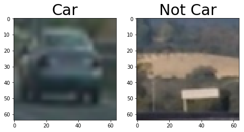
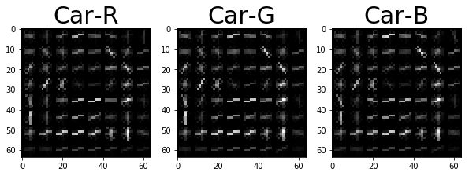
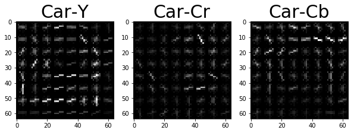
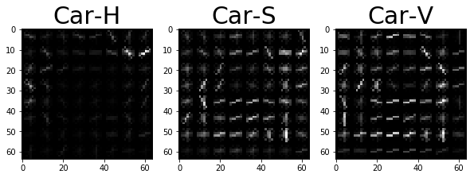
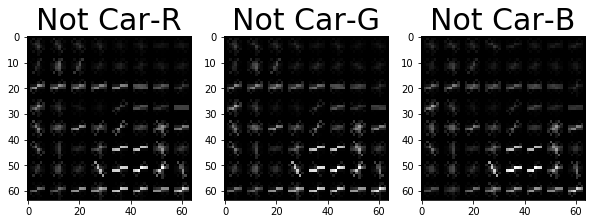
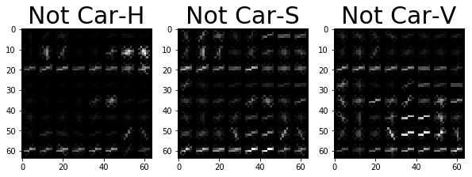
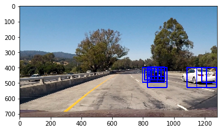
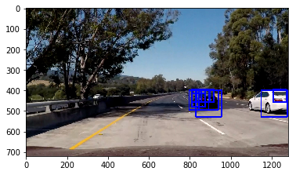
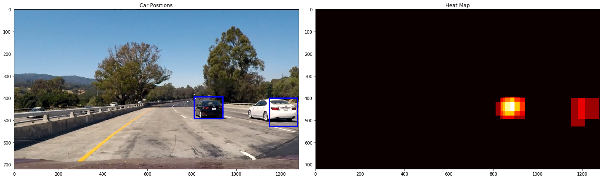
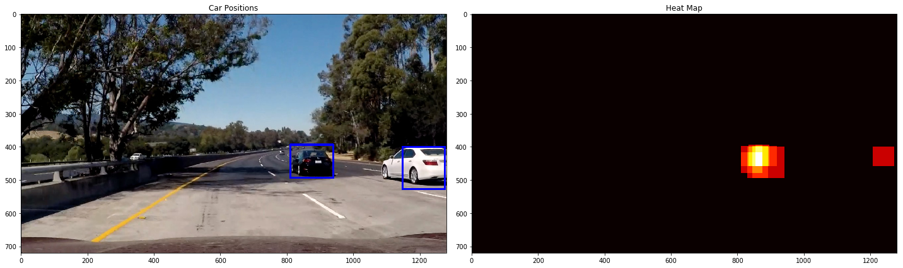

# Vehicle Detection Project

The goals / steps of this project are the following:

* Perform a Histogram of Oriented Gradients (HOG) feature extraction on a labeled training set of images and train a classifier Linear SVM classifier
* Apply a color transform and append binned color features, as well as histograms of color, to HOG feature vector.
* Normalize features and randomize a selection for training and testing.
* Implement a sliding-window technique and use the trained classifier to search for vehicles in images.
* Run your pipeline on a video stream (full project_video.mp4) and create a heat map of recurring detections frame by frame to reject outliers and follow detected vehicles.
* Estimate a bounding box for vehicles detected.


```python
#importing all the necessary libraries and functions required for the project
import matplotlib.image as mpimg
import matplotlib.pyplot as plt
import numpy as np
import cv2
import glob
import time
from sklearn.svm import LinearSVC, SVC
from sklearn.preprocessing import StandardScaler
from skimage.feature import hog
from tqdm import tqdm
from sklearn.cross_validation import train_test_split


```

    C:\ProgramData\Anaconda3\envs\carnd-term1-s\lib\site-packages\sklearn\cross_validation.py:41: DeprecationWarning: This module was deprecated in version 0.18 in favor of the model_selection module into which all the refactored classes and functions are moved. Also note that the interface of the new CV iterators are different from that of this module. This module will be removed in 0.20.
      "This module will be removed in 0.20.", DeprecationWarning)
    

Load the paths for car and not car images


```python
cars = []
notcars = []
for image in tqdm(glob.iglob('vehicles/**/*.png', recursive=True)):
    cars.append(image)
for image in tqdm(glob.iglob('non-vehicles/**/*.png', recursive=True)):
    notcars.append(image)
```

    8792it [00:04, 2041.50it/s]
    8968it [00:03, 2932.80it/s]
    

Below are all the functions from the classroom that will be used in the project.


```python
def get_hog_features(img, orient, pix_per_cell, cell_per_block, 
                        vis=False, feature_vec=True):
    # Call with two outputs if vis==True
    if vis == True:
        features, hog_image = hog(img, orientations=orient, pixels_per_cell=(pix_per_cell, pix_per_cell),
                                  cells_per_block=(cell_per_block, cell_per_block), block_norm= 'L2-Hys',
                                  transform_sqrt=True, 
                                  visualise=vis, feature_vector=feature_vec)
        return features, hog_image
    # Otherwise call with one output
    else:      
        features = hog(img, orientations=orient, pixels_per_cell=(pix_per_cell, pix_per_cell),
                       cells_per_block=(cell_per_block, cell_per_block), block_norm= 'L2-Hys',
                       transform_sqrt=True, 
                       visualise=vis, feature_vector=feature_vec)
        return features

def bin_spatial(img, size=(32, 32)):
    # Use cv2.resize().ravel() to create the feature vector
    features = cv2.resize(img, size).ravel() 
    # Return the feature vector
    return features

def color_hist(img, nbins=32, bins_range=(0, 256)):
    # Compute the histogram of the color channels separately
    channel1_hist = np.histogram(img[:,:,0], bins=nbins, range=bins_range)
    channel2_hist = np.histogram(img[:,:,1], bins=nbins, range=bins_range)
    channel3_hist = np.histogram(img[:,:,2], bins=nbins, range=bins_range)
    # Concatenate the histograms into a single feature vector
    hist_features = np.concatenate((channel1_hist[0], channel2_hist[0], channel3_hist[0]))
    # Return the individual histograms, bin_centers and feature vector
    return hist_features


def single_img_features(img, color_space='RGB', spatial_size=(32, 32),
                        hist_bins=32, orient=9, 
                        pix_per_cell=8, cell_per_block=2, hog_channel=0,
                        spatial_feat=True, hist_feat=True, hog_feat=True):    
    #1) Define an empty list to receive features
    img_features = []
    #2) Apply color conversion if other than 'RGB'
    if color_space != 'RGB':
        if color_space == 'HSV':
            feature_image = cv2.cvtColor(img, cv2.COLOR_RGB2HSV)
        elif color_space == 'LUV':
            feature_image = cv2.cvtColor(img, cv2.COLOR_RGB2LUV)
        elif color_space == 'HLS':
            feature_image = cv2.cvtColor(img, cv2.COLOR_RGB2HLS)
        elif color_space == 'YUV':
            feature_image = cv2.cvtColor(img, cv2.COLOR_RGB2YUV)
        elif color_space == 'YCrCb':
            feature_image = cv2.cvtColor(img, cv2.COLOR_RGB2YCrCb)
    else: feature_image = np.copy(img)      
    #3) Compute spatial features if flag is set
    if spatial_feat == True:
        spatial_features = bin_spatial(feature_image, size=spatial_size)
        #4) Append features to list
        img_features.append(spatial_features)
    #5) Compute histogram features if flag is set
    if hist_feat == True:
        hist_features = color_hist(feature_image, nbins=hist_bins)
        #6) Append features to list
        img_features.append(hist_features)
    #7) Compute HOG features if flag is set
    if hog_feat == True:
        if hog_channel == 'ALL':
            hog_features = []
            for channel in range(feature_image.shape[2]):
#                 if channel == 0:
#                     continue
                hog_features.extend(get_hog_features(feature_image[:,:,channel], 
                                    orient, pix_per_cell, cell_per_block, 
                                    vis=False, feature_vec=True))      
        else:
            hog_features = get_hog_features(feature_image[:,:,hog_channel], orient, 
                        pix_per_cell, cell_per_block, vis=False, feature_vec=True)
        #8) Append features to list
        img_features.append(hog_features)

    #9) Return concatenated array of features
    return np.concatenate(img_features)


def extract_features(imgs, color_space='RGB', spatial_size=(32, 32),
                        hist_bins=32, orient=9, 
                        pix_per_cell=8, cell_per_block=2, hog_channel=0,
                        spatial_feat=True, hist_feat=True, hog_feat=True):
    # Create a list to append feature vectors to
    features = []
    # Iterate through the list of images
    for file in tqdm(imgs):
        file_features = []
        # Read in each one by one
        image = mpimg.imread(file)
        # apply color conversion if other than 'RGB'
        if color_space != 'RGB':
            if color_space == 'HSV':
                feature_image = cv2.cvtColor(image, cv2.COLOR_RGB2HSV)
            elif color_space == 'LUV':
                feature_image = cv2.cvtColor(image, cv2.COLOR_RGB2LUV)
            elif color_space == 'HLS':
                feature_image = cv2.cvtColor(image, cv2.COLOR_RGB2HLS)
            elif color_space == 'YUV':
                feature_image = cv2.cvtColor(image, cv2.COLOR_RGB2YUV)
            elif color_space == 'YCrCb':
                feature_image = cv2.cvtColor(image, cv2.COLOR_RGB2YCrCb)
        else: feature_image = np.copy(image)      

        if spatial_feat == True:
            spatial_features = bin_spatial(feature_image, size=spatial_size)
            file_features.append(spatial_features)
        if hist_feat == True:
            # Apply color_hist()
            hist_features = color_hist(feature_image, nbins=hist_bins)
            file_features.append(hist_features)
        if hog_feat == True:
        # Call get_hog_features() with vis=False, feature_vec=True
            if hog_channel == 'ALL':
                hog_features = []
                for channel in range(feature_image.shape[2]):
                    hog_features.append(get_hog_features(feature_image[:,:,channel], 
                                        orient, pix_per_cell, cell_per_block, 
                                        vis=False, feature_vec=True))
                hog_features = np.ravel(hog_features)        
            else:
                hog_features = get_hog_features(feature_image[:,:,hog_channel], orient, 
                            pix_per_cell, cell_per_block, vis=False, feature_vec=True)
            # Append the new feature vector to the features list
            file_features.append(hog_features)
        features.append(np.concatenate(file_features))
    # Return list of feature vectors
    return features

def slide_window(img, x_start_stop=[None, None], y_start_stop=[None, None], 
                    xy_window=(64, 64), xy_overlap=(0.5, 0.5)):
    # If x and/or y start/stop positions not defined, set to image size
    if x_start_stop[0] == None:
        x_start_stop[0] = 0
    if x_start_stop[1] == None:
        x_start_stop[1] = img.shape[1]
    if y_start_stop[0] == None:
        y_start_stop[0] = 0
    if y_start_stop[1] == None:
        y_start_stop[1] = img.shape[0]
    # Compute the span of the region to be searched    
    xspan = x_start_stop[1] - x_start_stop[0]
    yspan = y_start_stop[1] - y_start_stop[0]
    # Compute the number of pixels per step in x/y
    nx_pix_per_step = np.int(xy_window[0]*(1 - xy_overlap[0]))
    ny_pix_per_step = np.int(xy_window[1]*(1 - xy_overlap[1]))
    # Compute the number of windows in x/y
    nx_buffer = np.int(xy_window[0]*(xy_overlap[0]))
    ny_buffer = np.int(xy_window[1]*(xy_overlap[1]))
    nx_windows = np.int((xspan-nx_buffer)/nx_pix_per_step) 
    ny_windows = np.int((yspan-ny_buffer)/ny_pix_per_step) 
    # Initialize a list to append window positions to
    window_list = []
    # Loop through finding x and y window positions
    # Note: you could vectorize this step, but in practice
    # you'll be considering windows one by one with your
    # classifier, so looping makes sense
    for ys in range(ny_windows):
        for xs in range(nx_windows):
            # Calculate window position
            startx = xs*nx_pix_per_step + x_start_stop[0]
            endx = startx + xy_window[0]
            starty = ys*ny_pix_per_step + y_start_stop[0]
            endy = starty + xy_window[1]
            
            # Append window position to list
            window_list.append(((startx, starty), (endx, endy)))
    # Return the list of windows
    return window_list


# Define a function you will pass an image 
# and the list of windows to be searched (output of slide_windows())
def search_windows(img, windows, clf, scaler, color_space='RGB', 
                    spatial_size=(32, 32), hist_bins=32, 
                    hist_range=(0, 256), orient=9, 
                    pix_per_cell=8, cell_per_block=2, 
                    hog_channel=0, spatial_feat=True, 
                    hist_feat=True, hog_feat=True):

    #1) Create an empty list to receive positive detection windows
    on_windows = []
    #2) Iterate over all windows in the list
    for window in windows:
        #3) Extract the test window from original image
        test_img = cv2.resize(img[window[0][1]:window[1][1], window[0][0]:window[1][0]], (64, 64))      
        #4) Extract features for that window using single_img_features()
        features = single_img_features(test_img, color_space=color_space, 
                            spatial_size=spatial_size, hist_bins=hist_bins, 
                            orient=orient, pix_per_cell=pix_per_cell, 
                            cell_per_block=cell_per_block, 
                            hog_channel=hog_channel, spatial_feat=spatial_feat, 
                            hist_feat=hist_feat, hog_feat=hog_feat)
        #5) Scale extracted features to be fed to classifier
        test_features = scaler.transform(np.array(features).reshape(1, -1))
        #6) Predict using your classifier
        prediction = clf.predict(test_features)
        #7) If positive (prediction == 1) then save the window
        if prediction == 1:
            on_windows.append(window)
    #8) Return windows for positive detections
    return on_windows
    
def draw_boxes(img, bboxes, color=(0, 0, 255), thick=6):
    # Make a copy of the image
    imcopy = np.copy(img)
    # Iterate through the bounding boxes
    for bbox in bboxes:
        # Draw a rectangle given bbox coordinates
        cv2.rectangle(imcopy, bbox[0], bbox[1], color, thick)
    # Return the image copy with boxes drawn
    return imcopy    

from scipy.ndimage.measurements import label
#heat = np.zeros_like(window_img[:,:,0]).astype(np.float)

def add_heat(heatmap, bbox_list):
    # Iterate through list of bboxes
    for box in bbox_list:
        # Add += 1 for all pixels inside each bbox
        # Assuming each "box" takes the form ((x1, y1), (x2, y2))
        heatmap[box[0][1]:box[1][1], box[0][0]:box[1][0]] += 1

    # Return updated heatmap
    return heatmap# Iterate through list of bboxes
    
def apply_threshold(heatmap, threshold):
    # Zero out pixels below the threshold
    heatmap[heatmap <= threshold] = 0
    # Return thresholded map
    return heatmap

def draw_labeled_bboxes(img, labels):
    # Iterate through all detected cars
    for car_number in range(1, labels[1]+1):
        # Find pixels with each car_number label value
        nonzero = (labels[0] == car_number).nonzero()
        # Identify x and y values of those pixels
        nonzeroy = np.array(nonzero[0])
        nonzerox = np.array(nonzero[1])
        # Define a bounding box based on min/max x and y
        bbox = ((np.min(nonzerox), np.min(nonzeroy)), (np.max(nonzerox), np.max(nonzeroy)))
        # Draw the box on the image
        cv2.rectangle(img, bbox[0], bbox[1], (0,0,255), 6)
    # Return the image
    return img

def display_images(imgs, labels, is_gray=False, figsize=(20,10), fontsize=30):
   '''
   Displays images and labels in a plot
   '''
   f, axes = plt.subplots(1, len(imgs), figsize=figsize)
   for i in range(0,len(imgs)):
       if is_gray:
           axes[i].imshow(imgs[i], cmap='gray')
       else:
           axes[i].imshow(imgs[i])
       axes[i].set_title(labels[i], fontsize=fontsize)
   return axes

```


```python
sample_car_image = mpimg.imread(cars[23])
sample_not_car = mpimg.imread(notcars[203])
display_images([sample_car_image,sample_not_car],['Car','Not Car'],figsize=(8,4))
```


    array([<matplotlib.axes._subplots.AxesSubplot object at 0x000001CB610543C8>,
           <matplotlib.axes._subplots.AxesSubplot object at 0x000001CB6119BBA8>], dtype=object)





### Histogram of Oriented Gradients (HOG)
In this project i have used HOG features and color features to train the model.
Let's see the visualization of HOG features in different color channels.


```python
orient = 9
features, hog_image_r = get_hog_features(sample_car_image[:,:,0], orient= orient, 
                        pix_per_cell= 8, cell_per_block= 2, 
                        vis=True, feature_vec=False)

features, hog_image_g = get_hog_features(sample_car_image[:,:,1], orient= orient, 
                        pix_per_cell= 8, cell_per_block= 2, 
                        vis=True, feature_vec=False)

features, hog_image_b = get_hog_features(sample_car_image[:,:,2], orient= orient, 
                        pix_per_cell= 8, cell_per_block= 2, 
                        vis=True, feature_vec=False)

image_ycr = cv2.cvtColor(sample_car_image, cv2.COLOR_RGB2YCrCb)
orient = 9
features, hog_image_y = get_hog_features(image_ycr[:,:,0], orient= orient, 
                        pix_per_cell= 8, cell_per_block= 2, 
                        vis=True, feature_vec=False)

features, hog_image_cr = get_hog_features(image_ycr[:,:,1], orient= orient, 
                        pix_per_cell= 8, cell_per_block= 2, 
                        vis=True, feature_vec=False)

features, hog_image_cb = get_hog_features(image_ycr[:,:,2], orient= orient, 
                        pix_per_cell= 8, cell_per_block= 2, 
                        vis=True, feature_vec=False)

image_hsv = cv2.cvtColor(sample_car_image, cv2.COLOR_RGB2HSV)
orient = 9
features, hog_image_h = get_hog_features(image_hsv[:,:,0], orient= orient, 
                        pix_per_cell= 8, cell_per_block= 2, 
                        vis=True, feature_vec=False)

features, hog_image_s = get_hog_features(image_hsv[:,:,1], orient= orient, 
                        pix_per_cell= 8, cell_per_block= 2, 
                        vis=True, feature_vec=False)

features, hog_image_v = get_hog_features(image_hsv[:,:,2], orient= orient, 
                        pix_per_cell= 8, cell_per_block= 2, 
                        vis=True, feature_vec=False)

display_images([hog_image_r,hog_image_g,hog_image_b],['Car-R','Car-G','Car-B'],is_gray=True,figsize=(10,5))
display_images([hog_image_y,hog_image_cr,hog_image_cb],['Car-Y','Car-Cr','Car-Cb'],is_gray=True,figsize=(10,5))
display_images([hog_image_h,hog_image_s,hog_image_v],['Car-H','Car-S','Car-V'],is_gray=True,figsize=(10,5))


orient = 9
features, hog_image_r = get_hog_features(sample_not_car[:,:,0], orient= orient, 
                        pix_per_cell= 8, cell_per_block= 2, 
                        vis=True, feature_vec=False)

features, hog_image_g = get_hog_features(sample_not_car[:,:,1], orient= orient, 
                        pix_per_cell= 8, cell_per_block= 2, 
                        vis=True, feature_vec=False)

features, hog_image_b = get_hog_features(sample_not_car[:,:,2], orient= orient, 
                        pix_per_cell= 8, cell_per_block= 2, 
                        vis=True, feature_vec=False)

image_ycr = cv2.cvtColor(sample_not_car, cv2.COLOR_RGB2YCrCb)
orient = 9
features, hog_image_y = get_hog_features(image_ycr[:,:,0], orient= orient, 
                        pix_per_cell= 8, cell_per_block= 2, 
                        vis=True, feature_vec=False)

features, hog_image_cr = get_hog_features(image_ycr[:,:,1], orient= orient, 
                        pix_per_cell= 8, cell_per_block= 2, 
                        vis=True, feature_vec=False)

features, hog_image_cb = get_hog_features(image_ycr[:,:,2], orient= orient, 
                        pix_per_cell= 8, cell_per_block= 2, 
                        vis=True, feature_vec=False)

image_hsv = cv2.cvtColor(sample_not_car, cv2.COLOR_RGB2HSV)
orient = 9
features, hog_image_h = get_hog_features(image_hsv[:,:,0], orient= orient, 
                        pix_per_cell= 8, cell_per_block= 2, 
                        vis=True, feature_vec=False)

features, hog_image_s = get_hog_features(image_hsv[:,:,1], orient= orient, 
                        pix_per_cell= 8, cell_per_block= 2, 
                        vis=True, feature_vec=False)

features, hog_image_v = get_hog_features(image_hsv[:,:,2], orient= orient, 
                        pix_per_cell= 8, cell_per_block= 2, 
                        vis=True, feature_vec=False)

display_images([hog_image_r,hog_image_g,hog_image_b],['Not Car-R','Not Car-G','Not Car-B'],is_gray=True,figsize=(10,5))
display_images([hog_image_y,hog_image_cr,hog_image_cb],['Not Car-Y','Not Car-Cr','Not Car-Cb'],is_gray=True,figsize=(10,5))
display_images([hog_image_h,hog_image_s,hog_image_v],['Not Car-H','Not Car-S','Not Car-V'],is_gray=True,figsize=(10,5))

```


    array([<matplotlib.axes._subplots.AxesSubplot object at 0x000001CB616E3A20>,
           <matplotlib.axes._subplots.AxesSubplot object at 0x000001CB61695438>,
           <matplotlib.axes._subplots.AxesSubplot object at 0x000001CB62744860>], dtype=object)

















HOG features for RGB and YCrCb channel looks good.After experimentation on training the model and checking accuracy(in the upcoming steps) i **decided to go with YCrCb channel** for extracting HOG features.
For the parameters: First i used the parameters in the code from the classroom, i played with them a bit,time taken using larger pix_per_cell(16) and cell_per_block(4) was much less as compared to the default values (8,2) given in the classroom. But after running the pipeline on video steam. The results with the default values were much better.

I used the `spatial_size` as 16,16. This reduced the length of feature vector but satisfactory results were obtained with this,same is the case with `hist_bins`


```python
color_space = 'YCrCb' # Can be RGB, HSV, LUV, HLS, YUV, YCrCb
orient = 9  # HOG orientations
pix_per_cell = 8 # HOG pixels per cell
cell_per_block = 2 # HOG cells per block
hog_channel = "ALL" # Can be 0, 1, 2, or "ALL"
spatial_size = (16, 16) # Spatial binning dimensions
hist_bins = 16    # Number of histogram bins
spatial_feat = True # Spatial features on or off
hist_feat = True # Histogram features on or off
hog_feat = True # HOG features on or off
y_start_stop = [None, None] # Min and max in y to search in slide_window()

car_features = extract_features(cars, color_space=color_space, 
                        spatial_size=spatial_size, hist_bins=hist_bins, 
                        orient=orient, pix_per_cell=pix_per_cell, 
                        cell_per_block=cell_per_block, 
                        hog_channel=hog_channel, spatial_feat=spatial_feat, 
                        hist_feat=hist_feat, hog_feat=hog_feat)
notcar_features = extract_features(notcars, color_space=color_space, 
                        spatial_size=spatial_size, hist_bins=hist_bins, 
                        orient=orient, pix_per_cell=pix_per_cell, 
                        cell_per_block=cell_per_block, 
                        hog_channel=hog_channel, spatial_feat=spatial_feat, 
                        hist_feat=hist_feat, hog_feat=hog_feat)

```

    100%|██████████████████████████████████████| 8792/8792 [06:08<00:00, 23.88it/s]
    100%|██████████████████████████████████████| 8968/8968 [06:10<00:00, 24.19it/s]
    

### Training the classifier

I used `SVC with rbf kernel and C parameter as 10` because a higher value of C because a high C aims at classifying all training examples correctly [Source](http://scikit-learn.org/stable/auto_examples/svm/plot_rbf_parameters.html). False positives were much less detected with rbf kernel of SVC instead of Linear SVC.
I have used the StandardScaler(line 13 of below cell) from sklearn to normalize features by removing the mean and scaling it to unit variance.
The total data was split into 80% training data and 20% test data using train_test_split from sklearn and fed it a random number between 0 and 100(lines 8 - 10 of below cell).
I am getting `test accuracy between 98.8 and 99.3%`. It varies slightly everytime i run it. 


```python
# Create an array stack of feature vectors
X = np.vstack((car_features, notcar_features)).astype(np.float64)

# Define the labels vector
y = np.hstack((np.ones(len(car_features)), np.zeros(len(notcar_features))))

# Split up data into randomized training and test sets
rand_state = np.random.randint(0, 100)
X_train, X_test, y_train, y_test = train_test_split(
    X, y, test_size=0.2, random_state=rand_state)
    
# Fit a per-column scaler
X_scaler = StandardScaler().fit(X_train)

# Apply the scaler to X
X_train = X_scaler.transform(X_train)
X_test = X_scaler.transform(X_test)

print('Using:',orient,'orientations',pix_per_cell,
    'pixels per cell and', cell_per_block,'cells per block')
print('Feature vector length:', len(X_train[0]))
svc = SVC(kernel='rbf',C=10)
t=time.time()
svc.fit(X_train, y_train)
t2 = time.time()
print(round(t2-t, 2), 'Seconds to train SVC...')
print('Test Accuracy of SVC = ', round(svc.score(X_test, y_test), 4))
```

    Using: 9 orientations 8 pixels per cell and 2 cells per block
    Feature vector length: 6108
    318.49 Seconds to train SVC...
    Test Accuracy of SVC =  0.9927
    

## Sliding Window Search

I found choosing the right number and size of sliding windows really important for this project.But more the number of windows more time it takes to generate the output and the machines provided to us were not high end, so i limited the region of interest. I started **sliding windows from 700 px in X direction to the end and 350px in Y direction to 656 px**.

I choose window of size `64x64 with an overlap of 65% within the interest range of 350px to 500px(Y-dir)` because the cars which are from away from our car will appear smaller in the image and will be on the upper region of the image.Going with this approach i choose `another window with size 96x96 to slide over the region 350px to 600px(Y-dir) with an overlap of 50%` and the `last window with size 128x128 to slide over the region 400px to 656px(Y-dir) with an overlap of 50%`.

The output of the sliding windows and the car detection after searching through the windows is shown below.


```python
image1 = mpimg.imread('test1.jpg')
image2 = mpimg.imread('test5.jpg')
copy1 = np.copy(image1)
copy2 = np.copy(image2)
draw_image1 = np.copy(image1)
draw_image2 = np.copy(image2)
image1 = image1.astype(np.float32)/255
image2 = image2.astype(np.float32)/255
windows_temp = []
windows1_temp = slide_window(image1, x_start_stop=[700, None], y_start_stop=[350,500], 
                    xy_window=(64, 64), xy_overlap=(0.65, 0.65))
windows_temp.extend(windows1_temp)
windows2_temp = slide_window(image1, x_start_stop=[700, None], y_start_stop=[350,600], 
                    xy_window=(96, 96), xy_overlap=(0.5, 0.5))
windows_temp.extend(windows2_temp)
windows3_temp = slide_window(image1, x_start_stop=[700, None], y_start_stop=[400,656], 
                    xy_window=(128, 128), xy_overlap=(0.5, 0.5))
windows_temp.extend(windows3_temp)
print('Total windows',len(windows_temp))

window_image = draw_boxes(draw_image1, windows_temp, color=(0, 0, 255), thick=3)
plt.imshow(window_image)
plt.show()
hot_windows_temp = search_windows(image1, windows_temp, svc, X_scaler, color_space=color_space, 
                        spatial_size=spatial_size, hist_bins=hist_bins, 
                        orient=orient, pix_per_cell=pix_per_cell, 
                        cell_per_block=cell_per_block, 
                        hog_channel=hog_channel, spatial_feat=spatial_feat, 
                        hist_feat=hist_feat, hog_feat=hog_feat)   
hot_windows_temp2 = search_windows(image2, windows_temp, svc, X_scaler, color_space=color_space, 
                        spatial_size=spatial_size, hist_bins=hist_bins, 
                        orient=orient, pix_per_cell=pix_per_cell, 
                        cell_per_block=cell_per_block, 
                        hog_channel=hog_channel, spatial_feat=spatial_feat, 
                        hist_feat=hist_feat, hog_feat=hog_feat)  

window_img_temp = draw_boxes(draw_image1, hot_windows_temp, color=(0, 0, 255), thick=6)                    
window_img_temp2 = draw_boxes(draw_image2, hot_windows_temp2, color=(0, 0, 255), thick=6)
plt.imshow(window_img_temp)
plt.show()
plt.imshow(window_img_temp2)
plt.show()
```

    Total windows 164
    








## Combining overlapping bounding boxes and removing false positives

I recorded the positions of positive detections in each frame of the video for 10 consecutive frames.So for each new frame I am using the positive detections of that frame along with the previous 9 frames and I created a heatmap and then thresholded that map to identify vehicle positions. I then used scipy.ndimage.measurements.label() to identify individual blobs in the heatmap. I then assumed each blob corresponded to a vehicle. I constructed bounding boxes to cover the area of each blob detected.

For the purpose of displaying heatmap for a single image I am not considering the past 9 frames, that will be done on the video pipeline.


```python
from scipy.ndimage.measurements import label


def add_heat(heatmap, bbox_list):
    # Iterate through list of bboxes
    for box in bbox_list:
        # Add += 1 for all pixels inside each bbox
        # Assuming each "box" takes the form ((x1, y1), (x2, y2))
        heatmap[box[0][1]:box[1][1], box[0][0]:box[1][0]] += 1

    # Return updated heatmap
    return heatmap# Iterate through list of bboxes
    
def apply_threshold(heatmap, threshold):
    # Zero out pixels below the threshold
    heatmap[heatmap <= threshold] = 0
    # Return thresholded map
    return heatmap

def draw_labeled_bboxes(img, labels):
    # Iterate through all detected cars
    for car_number in range(1, labels[1]+1):
        # Find pixels with each car_number label value
        nonzero = (labels[0] == car_number).nonzero()
        # Identify x and y values of those pixels
        nonzeroy = np.array(nonzero[0])
        nonzerox = np.array(nonzero[1])
        # Define a bounding box based on min/max x and y
        bbox = ((np.min(nonzerox), np.min(nonzeroy)), (np.max(nonzerox), np.max(nonzeroy)))
        # Draw the box on the image
        cv2.rectangle(img, bbox[0], bbox[1], (0,0,255), 6)
    # Return the image
    return img


```


```python
heat_temp = np.zeros_like(window_img_temp[:,:,0]).astype(np.float)
#Add heat to each box in box list
heat_temp = add_heat(heat_temp,hot_windows_temp)
    
# # Apply threshold to help remove false positives
heat_temp = apply_threshold(heat_temp,1)

# Visualize the heatmap when displaying    
heatmap_temp = np.clip(heat_temp, 0, 255)

# Find final boxes from heatmap using label function
labels_temp = label(heatmap_temp)
draw_img_heat = draw_labeled_bboxes(np.copy(copy1), labels_temp)

fig = plt.figure(figsize=(20,10))
plt.subplot(121)
plt.imshow(draw_img_heat)
plt.title('Car Positions')
plt.subplot(122)
plt.imshow(heatmap_temp, cmap='hot')
plt.title('Heat Map')
fig.tight_layout()

heat_temp2 = np.zeros_like(window_img_temp2[:,:,0]).astype(np.float)
#Add heat to each box in box list
heat_temp2 = add_heat(heat_temp2,hot_windows_temp2)
    
# # Apply threshold to help remove false positives
heat_temp2 = apply_threshold(heat_temp2,1)

# Visualize the heatmap when displaying    
heatmap_temp2 = np.clip(heat_temp2, 0, 255)

# Find final boxes from heatmap using label function
labels_temp2 = label(heatmap_temp2)
draw_img_heat2 = draw_labeled_bboxes(np.copy(copy2), labels_temp)

fig = plt.figure(figsize=(20,10))
plt.subplot(121)
plt.imshow(draw_img_heat2)
plt.title('Car Positions')
plt.subplot(122)
plt.imshow(heatmap_temp2, cmap='hot')
plt.title('Heat Map')
fig.tight_layout()
```








Preculating the windows before pipeline because the number of windows to be searched will be same for all the frames.


```python
temp_image  = mpimg.imread('test1.jpg')
windows = []
windows1 = slide_window(temp_image, x_start_stop=[700, None], y_start_stop=[350,500], 
                    xy_window=(64, 64), xy_overlap=(0.65, 0.65))
print('Total windows of size 64x64',len(windows1))
windows.extend(windows1)
windows2 = slide_window(temp_image, x_start_stop=[700, None], y_start_stop=[350,600], 
                    xy_window=(96, 96), xy_overlap=(0.5, 0.5))
print('Total windows of size 96x96',len(windows2))
windows.extend(windows2)
windows3 = slide_window(temp_image, x_start_stop=[700, None], y_start_stop=[400,656], 
                    xy_window=(128, 128), xy_overlap=(0.5, 0.5))
print('Total windows of size 128x128',len(windows3))
windows.extend(windows3)
print('Total Windows',len(windows))
```

    Total windows of size 64x64 96
    Total windows of size 96x96 44
    Total windows of size 128x128 24
    Total Windows 164
    

## Video Implementation

Below is the pipeline and [here is the link to my video result](project_video_final.mp4)


```python
heat_queue = []
hot_windows_queue = [None]*10
temp_cnt = 0
```


```python
def pipeline(in_image):
    global heat_queue
    global hot_windows_queue
    global temp_cnt
    draw_image = np.copy(in_image)
    just_another_copy = np.copy(in_image)
    in_image = in_image.astype(np.float32)/255
    hot_windows = search_windows(in_image, windows, svc, X_scaler, color_space=color_space, 
                            spatial_size=spatial_size, hist_bins=hist_bins, 
                            orient=orient, pix_per_cell=pix_per_cell, 
                            cell_per_block=cell_per_block, 
                            hog_channel=hog_channel, spatial_feat=spatial_feat, 
                            hist_feat=hist_feat, hog_feat=hog_feat)  

    window_img = draw_boxes(draw_image, hot_windows, color=(0, 0, 255), thick=6)
    if hot_windows_queue[0]==None:
        for i in range(10):
            hot_windows_queue[i] = hot_windows
    hot_windows_queue[temp_cnt % 10] = hot_windows
    all_hot = []
    for i in range(10):
        all_hot.extend(hot_windows_queue[i])
    
    heat = np.zeros_like(draw_image[:,:,0]).astype(np.float)
    heat = add_heat(heat,all_hot)    
    heat = apply_threshold(heat,10)
    heatmap = np.clip(heat, 0, 255)
    labels = label(heatmap)
    draw_img = draw_labeled_bboxes(np.copy(just_another_copy), labels)
    window_img = cv2.resize(window_img,(256,256))
    x_offset = 10
    y_offset = 10
    draw_img[y_offset:y_offset+window_img.shape[0], x_offset:x_offset+window_img.shape[1]] = window_img
    temp_cnt += 1
    return draw_img
```


```python
import os

from moviepy.video.VideoClip import VideoClip
from moviepy.editor import VideoFileClip
from IPython.display import HTML
white_output = 'project_video_final.mp4'
clip1 = VideoFileClip("project_video.mp4")
white_clip = clip1.fl_image(pipeline) 
%time white_clip.write_videofile(white_output, audio=False)
```

## Discussion

* Here i have implemented the project keeping a small region of interest for sliding window because of system issues.So the project will fail for some other video where the cars are on the left side of the frame.
* Here i did the project with lots of trial and error in tuning the parameters like the size and number of sliding windows,hog features,etc. There should be a better way of doing this.
* A deep neural network approach could be tried for this project.
